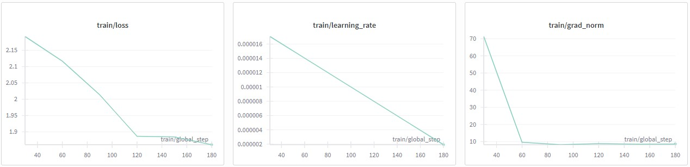
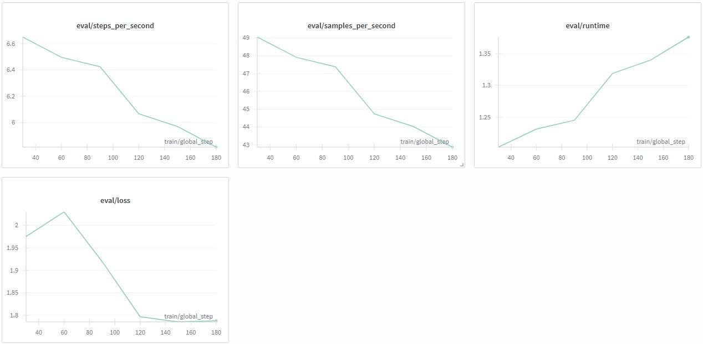
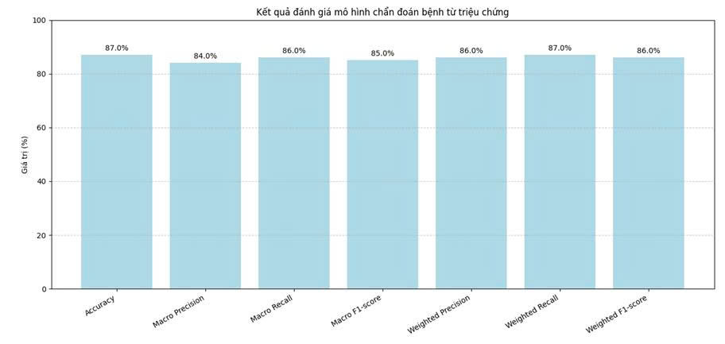

# MEDICAL SCREENING CHATBOT - Chatbot sàng lọc y tế


**MEDICAL SCREENING CHATBOT** là hệ thống tư vấn sức khỏe sàng lọc bệnh ban đầu ứng dụng kỹ thuật **Retrieval-Augmented Generation (RAG)**. Hệ thống kết hợp khả năng hiểu ngôn ngữ tiếng Việt vượt trội của **PhoBERT** (đã được tinh chỉnh (fine-tuned)) để truy xuất dữ liệu y khoa và sức mạnh tổng hợp thông tin của **Gemini-2.0-flash** để đưa ra lời khuyên chính xác, tự nhiên.

---

## Demo Giao Diện

Dưới đây là giao diện hoạt động thực tế của Chatbot:


*Giao diện người dùng thân thiện, hỗ trợ chat real-time với tốc độ phản hồi nhanh*


## Nguồn dữ liệu (Data Sources)
- Dữ liệu y tế trong dự án được thu thập từ website của Bệnh viện Đa khoa Tâm Anh.
- Quy mô dữ liệu gồm thông tin chi tiết của 583 bệnh (Tên bệnh, Triệu chứng, Chẩn đoán, Cách phòng ngừa, khoa khám).
- Dữ liệu được xử lý để phục vụ Fine-Tuned cho mô hình PhoBERT hiểu lĩnh vực y tế và lưu trữ trong FAISS để phục vụ RAG Pipeline.

Xử lý & Lưu trữ: Dữ liệu được làm sạch, tách từ bằng Underthesea, mã hóa vector (embedding) bởi PhoBERT và lưu trữ trong FAISS để phục vụ RAG Pipeline.
## Tính năng nổi bật

* **RAG Pipeline chính xác:** Sử dụng cơ chế tìm kiếm vector (Vector Search) với **FAISS** để tìm kiếm triệu chứng bệnh lý liên quan nhất trong cơ sở dữ liệu.
* **Fine-Tuned Embeddings:** Mô hình **PhoBERT** được huấn luyện thêm (Fine-tuning) với tác vụ MLM (Masked Language Modeling) trên dữ liệu y tế để tạo ra vector đặc trưng tốt hơn cho tiếng Việt chuyên ngành.
* **Hiệu năng cao:** Backend được xây dựng bằng **FastAPI**, hỗ trợ xử lý bất đồng bộ.
* **Giao diện trực quan:** Frontend HTML/CSS/JS đơn giản, dễ dàng tích hợp.

---

## Huấn luyện & Hiệu suất (Training & Performance)

Mô hình Embedding (PhoBERT) được tinh chỉnh (Fine-tuned) trên tập dữ liệu y tế để tối ưu hóa khả năng hiểu ngữ cảnh lâm sàng.

Quá trình huấn luyện được thực hiện trong Jupyter Notebook: `notebooks/FineTune_PhoBERT_Medical_MLM.ipynb`.

### Biểu đồ Loss (MLM Fine-tuning)
Dưới đây là biểu đồ sự hội tụ của hàm mất mát (Loss function) trong quá trình huấn luyện, cho thấy mô hình học tốt các đặc trưng của dữ liệu y tế:




> Quá trình Fine-tuning PhoBERT trên dữ liệu y tế cho thấy sự hội tụ tốt. Training Loss và Evaluation Loss đều giảm ổn định về mức ~1.8, xác nhận mô hình đã học được các đặc trưng ngôn ngữ chuyên ngành mà không bị overfitting. Chiến lược giảm Learning Rate tuyến tính giúp quá trình tối ưu hóa diễn ra ổn định.
---

### Kết quả phân loại bệnh


> Mô hình dự đoán bệnh từ triệu chứng đạt 87% độ chính xác với điều kiện người dùng mô tả triệu chứng đầy đủ. Nhờ fine-tuned mô hình nhúng PhoBERT giúp embedding dữ liệu y tế chính xác hơn từ đó cải thiện độ chính xác hơn mô hình PhoBERT-base vốn hiểu ngôn ngữ tiếng Việt một cách tổng quát.
## Cấu trúc dự án

```text
MEDICAL_SCREENING_CHATBOT/
├── vector_store/                      # Cơ sở dữ liệu Vector (FAISS Index)
│   ├── medical_symptoms.index
│   └── medical_symptoms.pkl
├── models/                    # Trọng số mô hình PhoBERT sau khi Fine-tune
│   └── phobert-medical-final/
├── notebooks/                 # Mã nguồn huấn luyện & xử lý dữ liệu
│   ├── FineTune_PhoBERT_Medical_MLM.ipynb
│   └── Build_VectorStore.ipynb
├── src/                       # Backend (FastAPI & Logic RAG)
│   ├── app.py                 # API Server chính
│   ├── config.py              # Cấu hình hệ thống
│   ├── embeddings.py          # Xử lý PhoBERT Embeddings
│   └── retriever.py           # Class tìm kiếm (Retriever)
├── frontend/                  # Giao diện người dùng
│   ├── index.html
│   ├── style.css
│   └── script.js
├── .env                       # Biến môi trường (API Key)
└── requirements.txt           # Danh sách thư viện
```

---

## Cài đặt
### Yêu cầu tiên quyết
- Python 3.10 trở lên  
- Git

```bash
git clone https://github.com/username/medical-rag-chatbot.git
cd medical-rag-chatbot
pip install -r requirements.txt
```
 > Lưu ý: Dữ liệu vector database y tế và model PhoBERT fine-tuned không được public. Repo chỉ phục vụ tham khảo mã nguồn, giao diện và workflow.

## Công nghệ sử dụng
- **LLM:** Google Gemini 2.0 Flash  
- **Embedding Model:** PhoBERT (VinAI) - Fine-tuned on Medical Dataset  
- **Vector Database:** FAISS (Facebook AI Similarity Search)  
- **Framework:** LangChain, FastAPI  
- **NLP Tools:** Underthesea (Vietnamese NLP)  

## Liên hệ
- Author: Phan Quyết Tâm Phú
- Email: tamphu.workhard@gmail.com
- LinkedIn: https://www.linkedin.com/in/phu-phanquyettam/
